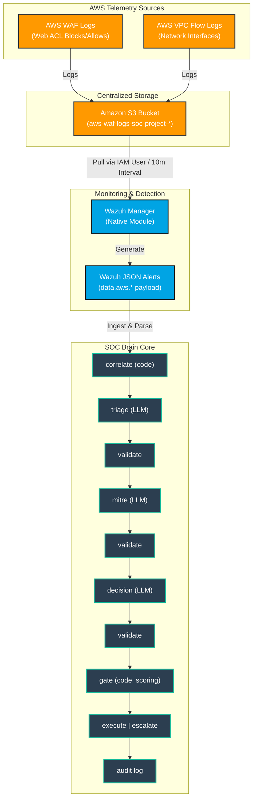

# Autonomous Multi-Agent SOC Brain Architecture

## Overview
This project implements an autonomous Security Operations Center (SOC) incident response pipeline. Security log telemetry from AWS infrastructure (AWS WAF and VPC Flow Logs) is ingested natively by the Wazuh Security Platform, normalized into standard data models, and analyzed by an LLM-driven multi-agent framework built with a hand-rolled deterministic Python state machine.

---

## Unified Data Ingestion & SOC Pipeline Architecture

---

## Data Flow Details

1. **Telemetry Ingestion Phase:**
   - AWS WAF records HTTP request details (`clientIp`, `uri`, `terminatingRuleId`).
   - AWS VPC Flow Logs record network interface IP flows (`srcaddr`, `dstaddr`, `action`).
   - Logs are continuously written to partitioned folders (`waf-logs/`, `vpc-logs/`) inside an Amazon S3 Bucket (`aws-waf-logs-soc-project-*`).

2. **Wazuh Monitoring Phase:**
   - The Wazuh Manager uses its native `<awss3>` integration module to pull raw log archives from S3 on a 10-minute poll interval. Both WAF and VPC Flow Log ingestions operate on this 10-minute interval.
   - Wazuh parses the raw log objects and emits unified JSON alerts, embedding AWS payload attributes under `data.aws.*`.

3. **Normalization Phase:**
   - The SOC Brain receives the Wazuh JSON payload.
   - Standardizes the event into a strongly-typed `NormalizedEvent` Pydantic model.

4. **Multi-Agent Decision & Mitigation Phase (Deterministic State Machine):**
   - The reasoning layer uses a hand-rolled deterministic Python state machine.
   - **Three agents in sequence**: Triage -> MITRE mapping -> Decision. 
   - Each agent has its own Pydantic schema, and the output is strictly validated before the next stage runs.
   - **Deterministic Gate**: Evaluates risk scores against defined policy thresholds (autonomous_threshold: 0.75, soft_threshold: 0.45) to validate mitigation plans before executing actions. If validation fails at any point, the pipeline short-circuits to escalate and logs to the audit log.
