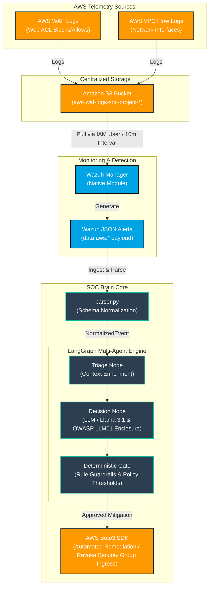

# Autonomous Multi-Agent SOC Brain Architecture

## Overview
This project implements an autonomous Security Operations Center (SOC) incident response pipeline. Security log telemetry from AWS infrastructure (AWS WAF and VPC Flow Logs) is ingested natively by the Wazuh Security Platform, normalized into standard data models, and analyzed by an LLM-driven multi-agent framework built with **LangGraph** and **LangChain**.

---

## Unified Data Ingestion & SOC Pipeline Architecture

---

## Data Flow Details

1. **Telemetry Ingestion Phase:**
   - AWS WAF records HTTP request details (`clientIp`, `uri`, `terminatingRuleId`).
   - AWS VPC Flow Logs record network interface IP flows (`srcaddr`, `dstaddr`, `action`).
   - Logs are continuously written to partitioned folders (`waf-logs/`, `vpc-logs/`) inside an Amazon S3 Bucket (`aws-waf-logs-soc-project-*`).

2. **Wazuh Monitoring Phase:**
   - The Wazuh Manager uses its native `<awss3>` integration module to pull raw log archives from S3 at 10-minute intervals.
   - Wazuh parses the raw log objects and emits unified JSON alerts, embedding AWS payload attributes under `data.aws.*`.

3. **Normalization Phase (`parser.py` & `schema.py`):**
   - The SOC Brain receives the Wazuh JSON payload.
   - `parse_wazuh_alert()` dynamically inspects `data.aws` to determine if the log originates from AWS WAF, AWS VPC Flow Logs, or standard Linux host security logs (`sshd`, `syslog`).
   - Standardizes the event into a strongly-typed `NormalizedEvent` Pydantic model.

4. **Multi-Agent Decision & Mitigation Phase:**
   - **Triage Node:** Enriches and structures event telemetry.
   - **Decision Node:** Analyzes threat indicators using Llama 3.1 wrapped strictly within `<untrusted_log>` XML tags to prevent **OWASP LLM01 Prompt Injection**.
   - **Deterministic Gate:** Evaluates risk scores against defined policy thresholds (`risk_score >= 5.0`) to validate mitigation plans before executing Boto3 AWS API actions.
